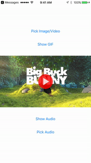

<p align="center">
  
</p>
[](https://travis-ci.org/Andrew Boryk/ABMediaView)
[](http://cocoapods.org/pods/ABMediaView)
[](http://cocoapods.org/pods/ABMediaView)
[](http://cocoapods.org/pods/ABMediaView)

## Screenshots



## Description

ABMediaView can display both images and videos. It subclasses UIImageView, and has functionality to lazy-load images from the web. In addition, it can also display videos, downloaded via URL from disk or web. Videos contain a player with a timeline and scrubbing. A major added functionality is that this mediaView has a queue and can present mediaViews in fullscreen mode. There is functionality which allows the view to be minimized by swiping, where it sits in the bottom right corner as a thumbnail. Videos can continue playing and be heard from this position. The user can choose to swipe the view away to dismiss. There various different functionality that can be toggled on and off to customize the view to one's choosing.


## Example

To run the example project, clone the repo, and run `pod install` from the Example directory first.

## Requirements

* Requires iOS 8.0 or later
* Requires Automatic Reference Counting (ARC)

## Features

* Display for image and video
* Easy Lazy-loading for images and video
* Fullscreen display with minimization
* Queue for presenting mediaViews in fullscreen
* Track for buffer, progress, and scrubbing 

## Installation

ABMediaView is available through [CocoaPods](http://cocoapods.org). To install
it, simply add the following line to your Podfile:

```ruby
pod "ABMediaView"
```

## Usage
### Calling the manager
As a singleton class, the manager can be accessed from anywhere within your app via the + sharedManager function:

```objective-c
[ABMediaView sharedManager];
```

***
### Initialization
An ABMediaView can be initilized programmatically, or by subclassing a UIImageView in the interface builder.

```objective-c
ABMediaView *mediaView = [[ABMediaView alloc] initWithFrame:self.view.frame];
```


ABMediaView comes with Lazy-loading functionality, where all that is needed to be provided is the image or video source URL. There is also a completion block where the downloaded image is returned for caching.

```objective-c
[mediaView setImageURL:@"http://yoursite.com/yourimage.jpg" withCompletion:^(UIImage *image, NSError *error) {
        
}];
    
[mediaView setVideoURL:@"http://yoursite/yourvideo.mp4"];
```


**VERY IMPORTANT** If your application supports device rotation, place the following block of code in your application's rootviewcontroller, or in the view controller which is intializing the ABMediaView. This will allow the ABMediaView to know when the user's device is rotating, and will enable it to rotate accordingly.

```objective-c
// If 'viewWillTransitionToSize' is already implemented in your code, add the two ABMediaViewNotifications to your 'animateAlongsideTransition' block
- (void)viewWillTransitionToSize:(CGSize)size withTransitionCoordinator:(id)coordinator {
    [super viewWillTransitionToSize:size withTransitionCoordinator:coordinator];
    
    // Executes before and after rotation, that way any ABMediaViews can adjust their frames for the new size. Is especially helpful when users are watching landscape videos and rotate their devices between portrait and landscape.
    
    [coordinator animateAlongsideTransition:^(id  _Nonnull context) {
        
        // Notifies the ABMediaView that the device is about to rotate
        [[NSNotificationCenter defaultCenter] postNotificationName:ABMediaViewWillRotateNotification object:nil];
        
    } completion:^(id  _Nonnull context) {
        
        // Notifies the ABMediaView that the device just finished rotating
        [[NSNotificationCenter defaultCenter] postNotificationName:ABMediaViewDidRotateNotification object:nil];
    }];
}
```

***
### Customization
ABMediaView also comes with an option for toggling the functionality which would allow the mediaView to be swiped away to the bottom right corner, and allows the user to interact with the underlying interface while the mediaView sits minimized. Video continues to play if already playing, and the user can swipe right to dismiss the minimized view.

```objective-c
[mediaView setCanMinimize: YES];
```


ABMediaView also comes with an option for toggling whether videos should replay after reaching the end.

```objective-c
[mediaView setAllowLooping:YES];
```


ABMediaView has several options for enabling and editing the progress track that shows when displaying videos

```objective-c
// Enable progress track to show at the bottom of the view
[mediaView setShowTrack:YES];

// Toggles the funtionality which would show remaining time instead of total time on the right label on the track
[mediaView setShowRemainingTime:YES];

/// Change the font for the labels on the track
[mediaView setTrackFont:[UIFont fontWithName:@"STHeitiTC-Medium" size:12.0f]];
```


ABMediaView has a theme color which changes the color of the track as well as the color of the play button

```objective-c
// Changing the theme color changes the color of the play indicator as well as the progress track
[mediaView setThemeColor:[UIColor redColor]];
```


ABMediaView will display images and videos according to the contentMode set on the view. However, there is also functionality to have the contentMode be set to aspectFill while the videoGravity is set to aspectFit.

```objective-c
// Setting the contentMode to aspectFit will set the videoGravity to aspectFit as well
mediaView.contentMode = UIViewContentModeScaleAspectFit;

// If you desire to have the image to fill the view, however you would like the videoGravity to be aspectFit, then you can implement this functionality
mediaView.contentMode = UIViewContentModeScaleAspectFill;
[mediaView changeVideoToAspectFit: YES];
```


If the ABMediaView is not a fullscreen view that was presented from the queue, the functionality can be enabled that would allow the ABMediaView to open up in fullscreen when selected.

```objective-c
[mediaView setShouldDisplayFullscreen:YES];
```


There is functionality to toggle hiding the close button, that way it does not show up in a fullscreen pop-up mediaView. This functionality is only allowed if isMinimizable is enabled, or else there would be no other way to close the pop-up.

```objective-c
[mediaView hideCloseButton:YES];
```


ABMediaView has functionality to set the frame from which the fullscreen pop-up will originate. This functionality is useful to combine with 'shouldDisplayFullscreen', as it will allow the pop-up to originate from the frame of the mediaView with 'shouldDisplayFullscreen' enabled.

```objective-c
/// Rect that specifies where the mediaView's frame will originate from when presenting, and needs to be converted into its position in the mainWindow
self.mediaView.originRect = self.mediaView.frame;
    
/// Rect that specifies where the mediaView's frame will originate from when presenting, and is already converted into its position in the mainWindow
self.mediaView.originRectConverted = self.mediaView.frame;
```


One can specify whether or not the ABMediaView is going to be displayed in a reusable view, which will allow for better UI transition performance for ABMediaView's that are not going to be reused.

```objective-c
mediaView.imageViewNotReused = YES;
```


When a ABMediaView's 'isMinimizable' value is enabled, the size ratio of the minimized view can be customized. The default value for this ratio is the preset ABMediaViewRatioPresetLandscape, which is a landscape 16:9 aspect ratio. There are also preset options for square (ABMediaViewRatioPresetSquare) and portrait 9:16 (ABMediaViewRatioPresetPortrait). 

```objective-c

// Aspect ratio of the minimized view
mediaView.minimizedAspectRatio = ABMediaViewRatioPresetLandscape;
mediaView.minimizedAspectRatio = ABMediaViewRatioPresetSquare;
mediaView.minimizedAspectRatio = ABMediaViewRatioPresetPortrait;
mediaView.minimizedAspectRatio = (5.0f/6.0f);
```


Accompanying the above option, the ratio of the screen's width that the minimized view will stretch across can also be specified. By default, the minimized view stretches across half the screen (0.5 ratio). This functionality is useful in adjusting the size of the minimized view for instances where the ABMediaView's 'minimizedAspectRatio' is greater than landscape.

```objective-c
// Ratio of the screen's width that the minimized view will stretch across
mediaView.minimizedWidthRatio = 0.5f;
```


***
### Delegate
There is a delegate with optional methods to determine when the ABMediaView has played or paused the video in its AVPlayer, as well as how much the view has minimized.

```objective-c
/// A listener to know what percentage that the view has minimized, at a value from 0 to 1
- (void) mediaView: (ABMediaView *) mediaView didChangeOffset: (float) offsetPercentage;

/// When the mediaView begins playing a video
- (void) mediaViewDidPlayVideo: (ABMediaView *) mediaView;

/// When the mediaView pauses a video
- (void) mediaViewDidPauseVideo: (ABMediaView *) mediaView;
```

## Author

Andrew Boryk, andrewcboryk@gmail.com

## License

ABMediaView is available under the MIT license. See the LICENSE file for more info.
