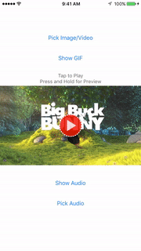

<p align="center">
  
</p>
[](https://travis-ci.org/AndrewBoryk/ABMediaView)
[](http://cocoapods.org/pods/ABMediaView)
[](http://cocoapods.org/pods/ABMediaView)
[](http://cocoapods.org/pods/ABMediaView)

## Screenshots



## Description

ABMediaView can display images, videos, as well as now GIFs and Audio! It subclasses UIImageView, and has functionality to lazy-load images from the web. In addition, it can also display videos, downloaded via URL from disk or web. Videos contain a player with a timeline and scrubbing. GIFs can also be displayed in an ABMediaView, via lazy-loading from the web, or set via NSData. The GIF that is downloaded is saved as a UIImage object for easy storage. Audio can also be displayed in the player by simply providing a url from the web or on disk. A major added functionality is that this mediaView has a queue and can present mediaViews in fullscreen mode. There is functionality which allows the view to be minimized by swiping, where it sits in the bottom right corner as a thumbnail. Videos can continue playing and be heard from this position. The user can choose to swipe the view away to dismiss. There are various different functionality that can be toggled on and off to customize the view to one's choosing.


## Table of Contents
  * [Description](#description)
  * [Example](#example)
  * [Requirements](#requirements)
  * [Features](#features)
    * [Future Features](#future-features)
  * [Installation](#installation)
  * [Usage](#usage)
    * [Calling the Manager](#calling-the-manager)
    * [Initialization](#initialization)
    * [Customization](#customization)
    * [Caching](#caching)
    * [Delegate](#delegate)
  * [Complimentary Libraries](#complimentary-libraries)
  * [Author](#author)
  * [License](#license)
    
## Example

To run the example project, clone the repo, and run `pod install` from the Example directory first.
  
## Requirements

* Requires iOS 8.0 or later
* Requires Automatic Reference Counting (ARC)

## Features

* Display for image, video, GIF, and Audio
* Easy Lazy-loading for images, videos, and GIFs
* Fullscreen display with minimization and dismissal
* Queue for presenting mediaViews in fullscreen
* Track for buffer, progress, and scrubbing
* Automated caching

## Future Features

- [ ] Progress and Loading views
- [ ] Zoom
- [ ] Tap to show details option (instead of tap to pause)

Tweet me [@TrepIsLife](https://twitter.com/TrepIsLife) if you have further feature suggestions!

## Installation

ABMediaView is available through [CocoaPods](http://cocoapods.org). To install
it, simply add the following line to your Podfile:

```ruby
pod "ABMediaView"
```

You can add import ABMediaView to your classes with the following line:

```objective-c
#import <ABMediaView/ABMediaView.h>
```

## Usage
### Calling the manager
As a singleton class, the manager can be accessed from anywhere within your app via the + sharedManager function:

```objective-c
[ABMediaView sharedManager];
```


There are several functions that can be used to queue, show, and dismiss ABMediaViews. These functions are handled by the sharedManager, the first of which is 'queueMediaView'. This function is used to add a new ABMediaView to the queue. If there are no ABMediaViews in the queue at the time that the view is added, then the newly-queued view will be presented.

```objective-c
[[ABMediaView sharedManager] queueMediaView:mediaView];
```


Secondly, if one is looking to present an ABMediaView and jump the queue, then this can be done by utilizing the 'presentMediaView' function. Calling this function will dismiss whatever ABMediaView is being currently presented, and will move the provided ABMediaView to the front of the queue.

```objective-c
// Presented with animation
[[ABMediaView sharedManager] presentMediaView:mediaView];

// Presented with the option to animate
[[ABMediaView sharedManager] presentMediaView:mediaView animated:NO];
```


On the other hand, if one is looking to dismiss the currently displayed ABMediaView, then the function 'dismissMediaViewAnimated:withCompletion:' can be called. If the view is minimized, this will make it move and disappear offscreen. If not, the view will just disappear. It comes with a completion block so that actions can be taken after the disappearance.

```objective-c
[mediaView dismissMediaViewAnimated:YES withCompletion:^(BOOL completed) {
    // Executes after mediaView finishes dismissing itself
}];
```


The following functionality combines the functionality of the previous two functions. If the queue has multiple ABMediaViews in it, then the next view can be displayed by calling the 'presentNextMediaView' function on the sharedManager. This function will dismiss the current ABMediaView, and present the next view in the queue. After the dismissal of the current ABMediaView, if there are no other views to be shown, then no further action is taken.

```objective-c
[[ABMediaView sharedManager] presentNextMediaView];
```


If there is an ABMediaView in the queue that should be removed, then it can be removed by calling the 'removeFromQueue' function on the sharedManager. This will remove the ABMediaView from the queue.

```objective-c
[[ABMediaView sharedManager] removeFromQueue:mediaView];
```

***
### Initialization
An ABMediaView can be initilized programmatically, or by subclassing a UIImageView in the interface builder.

```objective-c
ABMediaView *mediaView = [[ABMediaView alloc] initWithFrame:self.view.frame];
```


ABMediaView comes with Lazy-loading functionality, where all that is needed to be provided is the image or video source URL. There is also a completion block where the downloaded image is returned for caching.

```objective-c
// Set the image to be displayed in the mediaView, which will be downloaded and available for caching
[mediaView setImageURL:@"http://yoursite.com/yourimage.jpg"];

// Similar to the preview method, with a completion handler for when the image has completed downloading
[mediaView setImageURL:@"http://yoursite.com/yourimage.jpg" withCompletion:^(UIImage *image, NSError *error) {
    // Execute code upon completion
}];

// Set the video to be displayed in the mediaView, which will be downloaded and available for caching
[mediaView setVideoURL:@"http://yoursite/yourvideo.mp4"];

// Set both the video url, and the thumbnail image for the mediaView, downloading both and making both available for caching
[mediaView setVideoURL:@"http://yoursite/yourvideo.mp4" withThumbnailURL:@"http://yoursite.com/yourimage.jpg"];

// Set the video url for the mediaView , downloading it and making it available for caching, as well as the thumbnail image
[mediaView setVideoURL:@"http://yoursite/yourvideo.mp4" withThumbnailImage:[UIImage imageNamed: @"thumbnail.png"]];
```

If a file is being loaded off of the documents directory, (let's say you downloaded a video from the web and now want to display it), sourcing the content's NSURL from the directory can be specified by setting the 'fileFromDirectory' variable on the ABMediaView.

```objective-c
// Designates that the file is sourced from the Documents Directory of the user's device
[mediaView setFileFromDirectory:YES];
```


GIF support has also been made available for ABMediaView. To set a GIF to an ABMediaView, simply set it via URL or NSData, where it will be downloaded and set to the view. GIFs are made available as UIImages for easy storage. 

```objective-c
// GIFs can be displayed in ABMediaView, where the GIF can be downloaded from the internet
[mediaView setGifURL:@"http://yoursite/yourgif.gif"];

// GIFs can also be displayed via NSData
NSData *gifData = ...;
[mediaView setGifData:gifData];
```

In addition, Audio support has also been made available for ABMediaView. To set Audio to an ABMediaView, simply set it via URL, where it will be downloaded and set to the view. 

```objective-c
// Set the audio to be displayed in the mediaView
[mediaView setAudioURL:@"http://yoursite/youraudio.mp4"];

// Set both the audio and thumbnail url for the mediaView
[mediaView setAudioURL:@"http://yoursite/youraudio.mp4" withThumbnailURL:@"http://yoursite.com/yourimage.jpg"];

// Set the audio url for the mediaViee, as well as the thumbnail image
[mediaView setAudioURL:@"http://yoursite/youraudio.mp4" withThumbnailImage:[UIImage imageNamed:@"thumbnail.png"]];
```

In terms of playback throughout the app, functionality has been added where you can ensure that audio will play for the user, even if their device is on vibrate. These variables are set so that audio will either be enabled or disabled when media begins and ends playing in a ABMediaView, and can be set using the ABMediaView class methods:


```objective-c
// Toggle this functionality to enable/disable sound to play when an ABMediaView begins playing, and the user's app is on silent
[ABMediaView setPlaysAudioWhenPlayingMediaOnSilent:YES];
    
// In addition, toggle this functionality to enable/disable sound to play when an ABMediaView ends playing, and the user's app is on silent
[ABMediaView setPlaysAudioWhenStoppingMediaOnSilent:NO];
```


*BONUS FUNCTIONALITY:* GIFs can also be used as the thumbnail for video and audio.

```objective-c
// Set video for mediaView by URL, and set GIF as thumbnail by URL
[mediaView setVideoURL:@"www.video.com/urlHere" withThumbnailGifURL:@"http://yoursite/yourgif.gif"];

// Set video for mediaView by URL, and set GIF as thumbnail using NSData
[mediaView setVideoURL:@"www.video.com/urlHere" withThumbnailGifData:gifData];

// Set audio for mediaView by URL, and set GIF as thumbnail by URL
[mediaView setAudioURL:@"www.audio.com/urlHere" withThumbnailGifURL:@"http://yoursite/yourgif.gif"];

// Set audio for mediaView by URL, and set GIF as thumbnail using NSData
[mediaView setAudioURL:@"www.audio.com/urlHere" withThumbnailGifData:gifData];

```

Another bonus functionality has been added, where if a user presses and holds on an ABMediaView, a GIF preview is shown. This function is currently available for videos, and can be implemented using the following methods:

```objective-c
/// Set the url where the video can be downloaded from, as well as the image for the thumbnail, and added functionality where when the user presses and holds on the thumbnail, it turns into a GIF. GIF is added via URL
- (void) setVideoURL:(NSString *)videoURL withThumbnailImage:(UIImage *) thumbnail andPreviewGifURL:(NSString *) thumbnailGifURL;

/// Set the url where the video can be downloaded from, as well as the image for the thumbnail, and added functionality where when the user presses and holds on the thumbnail, it turns into a GIF. GIF is added via NSData
- (void) setVideoURL:(NSString *)videoURL withThumbnailImage:(UIImage *) thumbnail andPreviewGifData:(NSData *) thumbnailGifData;

/// Set the url where the video can be downloaded from, as well as the url where the thumbnail image can be found, and added functionality where when the user presses and holds on the thumbnail, it turns into a GIF. GIF is added via URL
- (void) setVideoURL:(NSString *)videoURL withThumbnailURL:(NSString *) thumbnailURL andPreviewGifURL:(NSString *) thumbnailGifURL;


/// Set the url where the video can be downloaded from, as well as the url where the thumbnail image can be found, and added functionality where when the user presses and holds on the thumbnail, it turns into a GIF. GIF is added via NSData
- (void) setVideoURL:(NSString *)videoURL withThumbnailURL:(NSString *) thumbnailURL andPreviewGifData:(NSData *) thumbnailGifData;
```


**VERY IMPORTANT** If your application supports device rotation, place the following block of code in your application's rootviewcontroller, or in the view controller which is intializing the ABMediaView. This will allow the ABMediaView to know when the user's device is rotating, and will enable it to rotate accordingly.

```objective-c
// If 'viewWillTransitionToSize' is already implemented in your code, add the two ABMediaViewNotifications to your 'animateAlongsideTransition' block
- (void)viewWillTransitionToSize:(CGSize)size withTransitionCoordinator:(id)coordinator {
    [super viewWillTransitionToSize:size withTransitionCoordinator:coordinator];
    
    // Executes before and after rotation, that way any ABMediaViews can adjust their frames for the new size. Is especially helpful when users are watching landscape videos and rotate their devices between portrait and landscape.
    
    [coordinator animateAlongsideTransition:^(id  _Nonnull context) {
        
        // Notifies the ABMediaView that the device is about to rotate
        [[NSNotificationCenter defaultCenter] postNotificationName:ABMediaViewWillRotateNotification object:nil];
        
    } completion:^(id  _Nonnull context) {
        
        // Notifies the ABMediaView that the device just finished rotating
        [[NSNotificationCenter defaultCenter] postNotificationName:ABMediaViewDidRotateNotification object:nil];
    }];
}
```

In relation to screen rotation, if your application's UI requires Portrait orientation, but you want the ABMediaView to be viewable in Landscape mode, methodology for handling this case has been included in the Example project. This is popular functionality, so it is included to make developing easier for such a functionality. The method leverages the delegate methods for ABMediaView to determine when the app should restrict rotation.

  
Lastly, when one is complete with an ABMediaView and wishes to wipe it clean to make room for new content to be displayed, a few methods are available for easily handling this task.

```objective-c
/// Removes image, video, audio and GIF data from the mediaView
- (void) resetMediaInView;

/// Resets all variables from mediaView, removing image, video, audio and GIF data
- (void) resetVariables;
```


***
### Customization
ABMediaView also comes with an option for toggling the functionality which would allow the mediaView to be swiped away to the bottom right corner, and allows the user to interact with the underlying interface while the mediaView sits minimized. Video and audio continues to play if already playing, and the user can swipe right to dismiss the minimized view.

```objective-c
[mediaView setIsMinimizable: YES];
```


For content such as images and GIFs, the variable 'isDismissable' can be set, which allows the user to swipe down to dismiss the view instead of minimize it. When set, this variable supersedes 'isMinimizable', and is useful for content that doesn't require constant playback.

```objective-c
[mediaView setIsDismissable: YES];
```


ABMediaView also comes with a few playback options for video and audio. One option, 'allowLooping', toggles whether media should replay after reaching the end. Another option, 'autoPlayAfterPresentation', toggles whether media should play automatically after presenting. By default, ABMediaView is set to autmatically play media after presentation.

```objective-c
// Toggle looping functionality
[mediaView setAllowLooping:YES];

// Toggle functionality to automatically play videos after presenting
[mediaView setAutoPlayAfterPresentation:YES];
```


ABMediaView has several options for enabling and editing the progress track that shows when displaying videos and audio

```objective-c
// Enable progress track to show at the bottom of the view
[mediaView setShowTrack:YES];

// Toggles the funtionality which would show remaining time instead of total time on the right label on the track
[mediaView setShowRemainingTime:YES];

/// Change the font for the labels on the track
[mediaView setTrackFont:[UIFont fontWithName:@"STHeitiTC-Medium" size:12.0f]];
```


ABMediaView has a theme color which changes the color of the track as well as the color of the play button

```objective-c
// Changing the theme color changes the color of the play indicator as well as the progress track
[mediaView setThemeColor:[UIColor redColor]];
```


ABMediaView will display images, videos, and GIFs according to the contentMode set on the view. However, there is also functionality to have the contentMode be set to aspectFill while the videoGravity is set to aspectFit.

```objective-c
// Setting the contentMode to aspectFit will set the videoGravity to aspectFit as well
mediaView.contentMode = UIViewContentModeScaleAspectFit;

// If you desire to have the image to fill the view, however you would like the videoGravity to be aspectFit, then you can implement this functionality
mediaView.contentMode = UIViewContentModeScaleAspectFill;
[mediaView changeVideoToAspectFit: YES];
```


If the ABMediaView is not a fullscreen view that was presented from the queue, the functionality can be enabled that would allow the ABMediaView to open up in fullscreen when selected.

```objective-cv
[mediaView setShouldDisplayFullscreen:YES];
```


If you would like to use a custom play button or failed indicator for an ABMediaView, you should set the 'customPlayButton' and 'customFailedButton' variables on the mediaView. (Applicable to video and audio)

```objective-cv
// Set a custom image for the play button visible on ABMediaView's with video or audio
mediaView.customPlayButton = [UIImage imageNamed:@"CustomPlayButtonImage"];

// Set a custom image for when the mediaView fails to play media
mediaView.custonFailedButton = [UIImage imageNamed:@"CustomFailedButtonImage"];
```


There is functionality to toggle hiding the close button, that way it does not show up in a fullscreen pop-up mediaView. This functionality is only allowed if isMinimizable is enabled, or else there would be no other way to close the pop-up. In addition, the close button remains visible when the view is held in landscape orientation, due to minimizing being disabled during landscape.

```objective-c
[mediaView setCloseButtonHidden:YES];
```


Similarly, there is functionality to have the play button hidden on media that can be played (video/audio). This functionality is useful if one is looking to use ABMediaView as a background video player.

```objective-c
[mediaView setPlayButtonHidden:YES];
```


In the case that there is a UIStatusBar on your screen that you would not like to hide, or instances where you would like to reserve space on the top of your screen for other views, ABMediaView possesses the ability to offset the subviews at the top of the screen to avoid hiding these views. Setting the 'topOffset' property of an ABMediaView would move down the 'closeButton' and any other top-anchored views. Again, a major use case for this would be to set the 'topOffset' property to 20px in order to avoid covering the UIStatusBar.

```objective-c
[mediaView setTopBuffer:20.0f];
```


By default, there is a buffer of 12px between the minimized ABMediaView and the screen's bottom. More space can be added by adjusting the 'bottomBuffer' value for the ABMediaView. This is useful in order to have the mediaView show above views such as UITabBars and UIToolbars, to avoid covering these views that need reserved space on the bottom of the screen.

```objective-c
[mediaView setBottomBuffer:0.0f];
```


To make these buffers easier to use, I have provided iOS standard presets for easy access to certain buffer values.

```objective-c
// ABBufferStatusBar = 20px
// ABBufferNavigationBar = 44px
// ABBufferStatusAndNavigationBar = 64px
// ABBufferTabBar = 49px

[mediaView setTopBuffer:ABBufferStatusBar];
[mediaView setBottomBuffer:ABBufferTabBar];
```


ABMediaView has functionality to set the frame from which the fullscreen pop-up will originate. This functionality is useful to combine with 'shouldDisplayFullscreen', as it will allow the pop-up to originate from the frame of the mediaView with 'shouldDisplayFullscreen' enabled. 

```objective-c
/// Rect that specifies where the mediaView's frame will originate from when presenting, and needs to be converted into its position in the mainWindow
mediaView.originRect = self.mediaView.frame;
    
/// Rect that specifies where the mediaView's frame will originate from when presenting, and is already converted into its position in the mainWindow
mediaView.originRectConverted = self.mediaView.frame;
```


However, if one is using dynamic UI, and therefore can not determine the originRect of the ABMediaView, one can set the property 'presentFromOriginRect' to true. With this functionality enabled, the fullscreen ABMediaView will popup from frame of the  ABMediaView which presents it. If 'presentFromOriginRect' is enabled, then there is no need to set 'originRect' or 'originRectConverted', as this property supersedes both.

```objective-c
self.mediaView.presentFromOriginRect = YES;
```


One can specify whether or not the ABMediaView is going to be displayed in a reusable view, which will allow for better UI transition performance for ABMediaView's that are not going to be reused.

```objective-c
mediaView.imageViewNotReused = YES;
```


When a ABMediaView's 'isMinimizable' value is enabled, the size ratio of the minimized view can be customized. The default value for this ratio is the preset ABMediaViewRatioPresetLandscape, which is a landscape 16:9 aspect ratio. There are also preset options for square (ABMediaViewRatioPresetSquare) and portrait 9:16 (ABMediaViewRatioPresetPortrait). 

```objective-c

// Aspect ratio of the minimized view
mediaView.minimizedAspectRatio = ABMediaViewRatioPresetLandscape;
mediaView.minimizedAspectRatio = ABMediaViewRatioPresetSquare;
mediaView.minimizedAspectRatio = ABMediaViewRatioPresetPortrait;
mediaView.minimizedAspectRatio = (6.0f/5.0f); // Height/Width
```


Accompanying the above option, the ratio of the screen's width that the minimized view will stretch across can also be specified. By default, the minimized view stretches across half the screen (0.5 ratio). This functionality is useful in adjusting the size of the minimized view for instances where the ABMediaView's 'minimizedAspectRatio' is greater than landscape.

```objective-c
// Ratio of the screen's width that the minimized view will stretch across
mediaView.minimizedWidthRatio = 0.5f;
```


***
### Caching
If your project does not have a caching system, and you are looking for an automated caching system, ABMediaView now has that! With ABMediaView, images and GIFs are saved in memory using NSCache, while videos and audio files are saved to disk. There are several options available for managing the cache, but let's start with how to enable automated caching. It can be done by setting the 'shouldCacheMedia' variable on the ABMediaView sharedManager.

```objective-c
[[ABMediaView sharedManager] setShouldCacheMedia:YES];
```

If you are looking to have videos and audio preloaded, you can have ABMediaView set to always download video and audio when the videoURL or audioURL is set on a mediaView by specifying 'shouldPreloadVideoAndAudio' on ABMediaView's sharedManager. However, if you are looking to preload video or audio on an individual instance basis, it can be done using the 'preloadVideo' and 'preloadAudio'. If you aren't looking to have videos or audio preloaded, and just have 'shouldCacheMedia' set to true, then video and audio will be streamed. At this moment, video is cached when the buffer is fully loaded from the stream. Audio is currently a work in progress.

```objective-c
// Ensure that all video and audio is preloaded before playing, instead of just streaming (works best if your app plays videos/audio that is short in length)
[[ABMediaView sharedManager] setShouldPreloadVideoAndAudio:YES];

// Preload the video for this specific mediaView
[mediaView preloadVideo];

// Preload the audio for this specific mediaView
[mediaView preloadAudio];
```


If one is looking to clear the memory cache of images and GIFs, just set 'shouldCacheMedia' to false on the ABMediaView sharedManager. However, to clear caches on disk for the Documents directory and the tmp directory, ABMediaView comes with an easy function to clear these caches.

```objective-c
// Clear all of the documents directory of cached items in the ABMedia folder
[ABMediaView clearABMediaDirectory:AllDirectoryItems];
    
// Clear the video directory of cached items in the ABMedia folder 
[ABMediaView clearABMediaDirectory:VideoDirectoryItems];
    
// Clear the audio directory of cached items in the ABMedia folder
[ABMediaView clearABMediaDirectory:AudioDirectoryItems];

// Clear all of the temp directory of cached items
[ABMediaView clearABMediaDirectory:TempDirectoryItems];
```

***
### Delegate
There is a delegate with optional methods to determine when the ABMediaView has played or paused the video in its AVPlayer, as well as how much the view has minimized.

```objective-c
/// A listener to know what percentage that the view has minimized, at a value from 0 to 1
- (void) mediaView: (ABMediaView *) mediaView didChangeOffset: (float) offsetPercentage;

/// When the mediaView begins playing a video
- (void) mediaViewDidPlayVideo: (ABMediaView *) mediaView;

/// When the mediaView pauses a video
- (void) mediaViewDidPauseVideo: (ABMediaView *) mediaView;
```


In addition, there are also delegate methods to help determine whether a ABMediaView is about to be shown, has been shown, about to be dismissed, and has been dismissed.

```objective-c
/// Called when the mediaView has begun the presentation process
- (void) mediaViewWillPresent: (ABMediaView *) mediaView;

/// Called when the mediaView has been presented
- (void) mediaViewDidPresent: (ABMediaView *) mediaView;

/// Called when the mediaView has begun the dismissal process
- (void) mediaViewWillDismiss: (ABMediaView *) mediaView;

/// Called when the mediaView has completed the dismissal process. Useful if not looking to utilize the dismissal completion block
- (void) mediaViewDidDismiss: (ABMediaView *) mediaView;
```


The following delegate methods are useful when looking to determine if the ABMediaView has begun, is in the process, or has completed minimizing. A popular use case for this would be adjust the UIStatusBarStyle depending on whether the ABMediaView is visible behind it.

```objective-c
/// Called when the mediaView is in the process of minimizing, and is about to make a change in frame
- (void) mediaViewWillChangeMinimization:(ABMediaView *)mediaView;

/// Called when the mediaView is in the process of minimizing, and has made a change in frame
- (void) mediaViewDidChangeMinimization:(ABMediaView *)mediaView;

/// Called before the mediaView ends minimizing, and informs whether the minimized view will snap to minimized or fullscreen mode
- (void) mediaViewWillEndMinimizing:(ABMediaView *)mediaView atMinimizedState:(BOOL)isMinimized;

/// Called when the mediaView ends minimizing, and informs whether the minimized view has snapped to minimized or fullscreen mode
- (void) mediaViewDidEndMinimizing:(ABMediaView *)mediaView atMinimizedState:(BOOL)isMinimized;
```


On the other hand, if one has the 'isDismissable' value set on their ABMediaView, delegate methods are provided to listen for when the mediaView will and has begun/ended the dismissing process.

```objective-c
/// Called when the mediaView is in the process of minimizing, and is about to make a change in frame
- (void) mediaViewWillChangeDismissing:(ABMediaView *)mediaView;

/// Called when the mediaView is in the process of minimizing, and has made a change in frame
- (void) mediaViewDidChangeDismissing:(ABMediaView *)mediaView;

/// Called before the mediaView ends minimizing, and informs whether the minimized view will snap to minimized or fullscreen mode
- (void) mediaViewWillEndDismissing:(ABMediaView *)mediaView withDismissal:(BOOL)didDismiss;

/// Called when the mediaView ends minimizing, and informs whether the minimized view has snapped to minimized or fullscreen mode
- (void) mediaViewDidEndDismissing:(ABMediaView *)mediaView withDismissal:(BOOL)didDismiss;
```


If one is looking to detect if the image contained in the ABMediaView has been set or changed, they can listen to the following delegate method.

```objective-c
/// Called when the mediaView 'image' property has been set or changed
- (void) mediaView:(ABMediaView *)mediaView didSetImage:(UIImage *) image;
```


If one is looking to cache the images, videos, or GIFs that are being downloaded via the ABMediaView, delegates have been made handle to get these objects.


```objective-c
/// Called when the mediaView has completed downloading the image from the web
- (void) mediaView:(ABMediaView *)mediaView didDownloadImage:(UIImage *) image;

/// Called when the mediaView has completed downloading the video from the web
- (void) mediaView:(ABMediaView *)mediaView didDownloadVideo: (NSString *)video;

/// Called when the mediaView has completed downloading the GIF from the web
- (void) mediaView:(ABMediaView *)mediaView didDownloadGif:(UIImage *)gif;
```

## Complimentary Libraries

* [ABVolumeControl](https://github.com/AndrewBoryk/ABVolumeControl): Overrides MPVolumeView with differents styles for a volumeView, as well as a delegate to implement one's own custom volumeView.
* [ABUtils](https://github.com/AndrewBoryk/ABUtils): A collections of useful methods that can be dropped into any project.
* [ABKeyboardAccessory](https://github.com/AndrewBoryk/ABKeyboardAccessory): UIView subclass which can be used as an 'inputAccessory', with delegate methods for knowing when keyboard frame changes, such as for appearance and disappearance.


## Author

Andrew Boryk, andrewcboryk@gmail.com

Reach out to me on Twitter: [@TrepIsLife](https://twitter.com/TrepIsLife) [![alt text][1.2]][1]

[1.2]: http://i.imgur.com/wWzX9uB.png (twitter icon without padding)
[1]: http://www.twitter.com/TrepIsLife

## License

ABMediaView is available under the MIT license. See the [LICENSE](LICENSE) file for more info.
